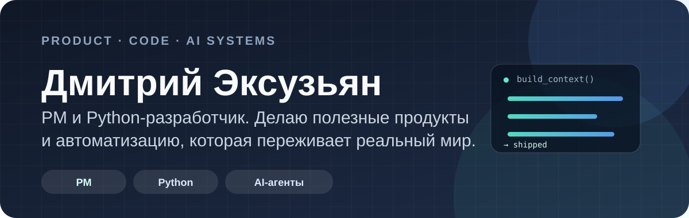
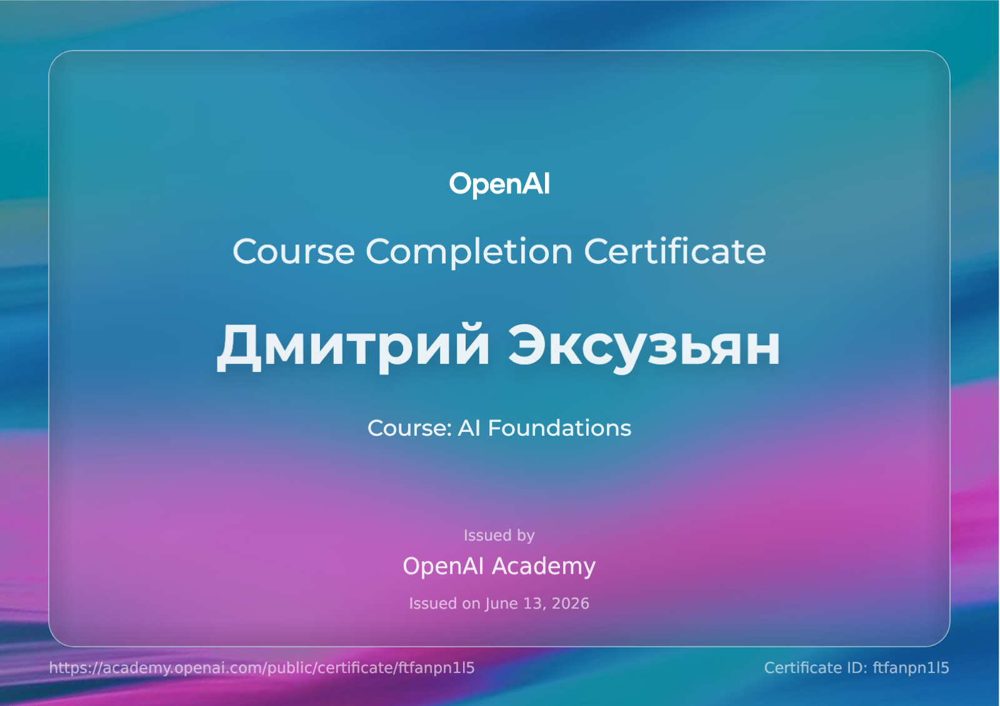
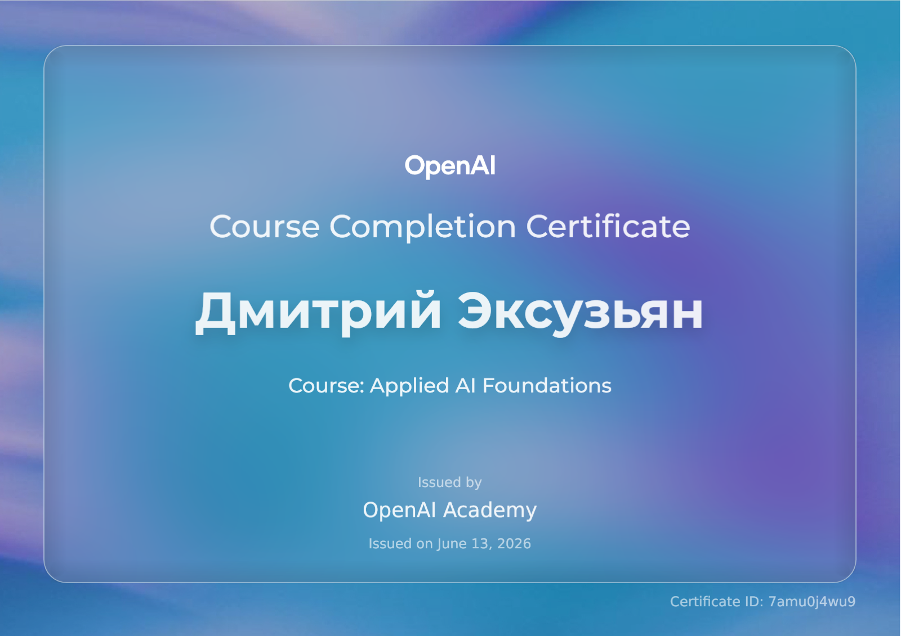
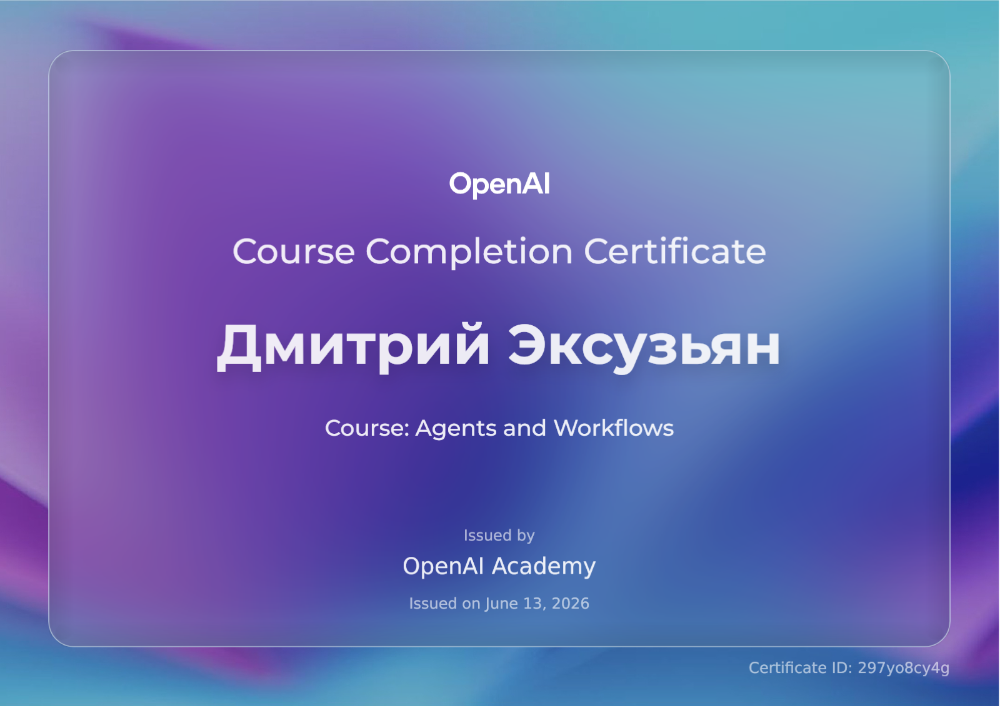
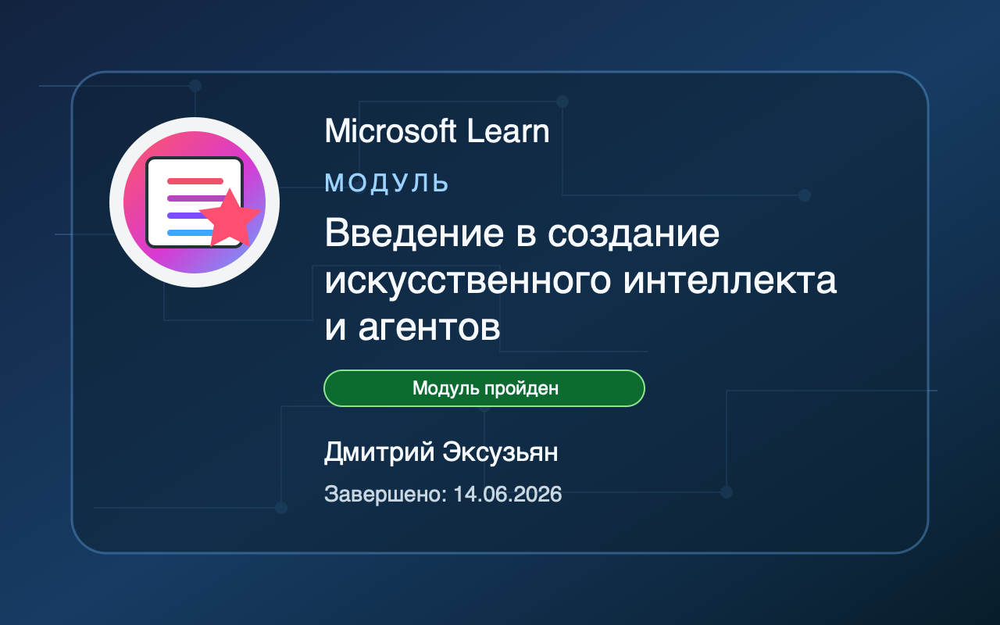

<p align="center">
  
</p>

<p align="center">
  
</p>

<p align="center">
  <a href="https://battrip.ru/"></a>
  <a href="https://github.com/Seven-Winds-Studio"></a>
</p>

## Рабочий стек

<p>
  
</p>

<div align="center">

## 🤖 Hermes damage report

<i>May 25, 2026 — Jun 09, 2026</i>

<br />


</div>

<details>
<summary><b>🧪 Open the basement logs: platforms, tools, skills and streaks</b></summary>

<div align="center">

### 📋 Overview

</div>

<table align="center">
  <tr>
    <td align="center"><b>Sessions</b><br />269</td>
    <td align="center"><b>Messages</b><br />14,392</td>
    <td align="center"><b>Tool calls</b><br />6,699</td>
    <td align="center"><b>User messages</b><br />1,295</td>
  </tr>
  <tr>
    <td align="center"><b>Input tokens</b><br />256,896,294</td>
    <td align="center"><b>Output tokens</b><br />2,594,121</td>
    <td align="center"><b>Total tokens</b><br />462,270,571</td>
    <td align="center"><b>Avg msgs/session</b><br />53.5</td>
  </tr>
  <tr>
    <td align="center"><b>Active time</b><br />~18.5d</td>
    <td align="center"><b>Avg session</b><br />~1h 47m</td>
    <td align="center"><b>Active days</b><br />16</td>
    <td align="center"><b>Best streak</b><br />16 days</td>
  </tr>
</table>

<div align="center">

### 🤖 Models Used

</div>

<table align="center">
  <tr>
    <th align="left">Model</th>
    <th align="right">Sessions</th>
    <th align="right">Tokens</th>
  </tr>
  <tr>
    <td><b>gpt-5.5</b></td>
    <td align="right">74</td>
    <td align="right">201,402,142</td>
  </tr>
  <tr>
    <td><b>deepseek-v4-pro</b></td>
    <td align="right">152</td>
    <td align="right">193,128,242</td>
  </tr>
  <tr>
    <td><b>gpt-5.4-mini</b></td>
    <td align="right">15</td>
    <td align="right">32,231,838</td>
  </tr>
  <tr>
    <td><b>deepseek-v4-flash</b></td>
    <td align="right">10</td>
    <td align="right">29,044,990</td>
  </tr>
  <tr>
    <td><b>kimi-k2.6</b></td>
    <td align="right">2</td>
    <td align="right">5,314,368</td>
  </tr>
  <tr>
    <td><b>gemini-2.5-flash</b></td>
    <td align="right">2</td>
    <td align="right">1,148,991</td>
  </tr>
  <tr>
    <td>gpt-5</td>
    <td align="right">7</td>
    <td align="right">0</td>
  </tr>
  <tr>
    <td>gemini-3.5-flash</td>
    <td align="right">5</td>
    <td align="right">0</td>
  </tr>
  <tr>
    <td>gemini-3.1-flash-lite-preview</td>
    <td align="right">2</td>
    <td align="right">0</td>
  </tr>
</table>

### 📱 Platforms

| Platform | Sessions | Messages | Tokens |
|---|---:|---:|---:|
| cli | 176 | 13,815 | 460,311,420 |
| cron | 90 | 465 | 679,316 |
| api_server | 3 | 112 | 1,279,835 |

### 🔧 Top Tools

| Tool | Calls | Share |
|---|---:|---:|
| terminal | 2,317 | 34.5% |
| read_file | 1,151 | 17.2% |
| search_files | 957 | 14.3% |
| execute_code | 437 | 6.5% |
| patch | 396 | 5.9% |
| skill_view | 261 | 3.9% |
| write_file | 227 | 3.4% |
| computer_use | 155 | 2.3% |
| todo | 146 | 2.2% |
| process | 122 | 1.8% |
| session_search | 120 | 1.8% |
| browser_navigate | 110 | 1.6% |
| browser_console | 64 | 1.0% |
| browser_snapshot | 53 | 0.8% |
| browser_click | 35 | 0.5% |
| ...and 21 more tools | — | — |

### 📅 Activity Patterns

```text
Mon  ███████████     49
Tue  ███████████████ 66
Wed  █████████████   59
Thu  ██████████      46
Fri  ███████         33
Sat  █               5
Sun  ██              11
```

Peak hours: **11PM** (22), **4PM** (21), **11AM** (19), **12PM** (18), **5PM** (17)

### 🏆 Notable Sessions

| Category | Value | Date / Session |
|---|---:|---|
| Longest session | 1.4d | May 30 · `20260530_141920_` |
| Most messages | 776 msgs | May 30 · `20260530_141920_` |
| Most tokens | 53,043,222 tokens | May 30 · `20260530_141920_` |
| Most tool calls | 357 calls | May 30 · `20260530_141920_` |

</details>

## Сертификаты и достижения

<table>
  <tr>
    <td align="center" width="50%">
      <a href="assets/openai-ai-foundations-certificate.pdf"></a>
      <br />
      <sub>OpenAI Academy — AI Foundations</sub>
    </td>
    <td align="center" width="50%">
      <a href="assets/openai-applied-ai-foundations-certificate.pdf"></a>
      <br />
      <sub>OpenAI Academy — Applied AI Foundations</sub>
    </td>
  </tr>
  <tr>
    <td align="center" width="50%">
      <a href="assets/openai-agents-and-workflows-certificate.pdf"></a>
      <br />
      <sub>OpenAI Academy — Agents and Workflows</sub>
    </td>
    <td align="center" width="50%">
      <a href="https://learn.microsoft.com/api/achievements/share/ru-ru/95665885/ABPHT3H7?sharingId=20BD20B2AC8736FD"></a>
      <br />
      <sub>Microsoft Learn — AI and Agents</sub>
    </td>
  </tr>
</table>

## Активность

<p align="center">
  <picture>
    <source media="(prefers-color-scheme: dark)" srcset="https://raw.githubusercontent.com/Bathert/Bathert/refs/heads/output/github-contribution-grid-snake-dark.svg" />
    <source media="(prefers-color-scheme: light)" srcset="https://raw.githubusercontent.com/Bathert/Bathert/refs/heads/output/github-contribution-grid-snake.svg" />
    
  </picture>
</p>

<p align="center"><sub>Нормальная документация, воспроизводимые проверки и немного контролируемого хаоса.</sub></p>
